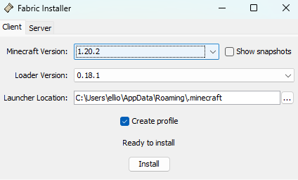

#SETUP

## Install Fabric
1. Go to this link and download the installer for windows https://fabricmc.net/use/installer/
2. Run the installer and select the version 1.20.2, then click install 
3. Launch the minecraft launcher, run the profile, and then exit the game
4. Download the mods folder here: https://drive.google.com/drive/folders/15oK8g1yszaey6hxJwvjbtfOC_0-l4qdB?usp=sharing
5. in file explorer, go to C:\Users\\"user"\appdata\roaming\\.minecraft\mods
6. Add the contents of the mod folder and put them in this folder
7. Ready to go!